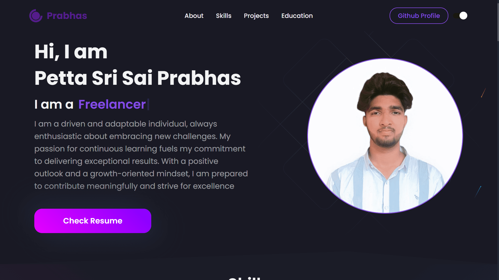
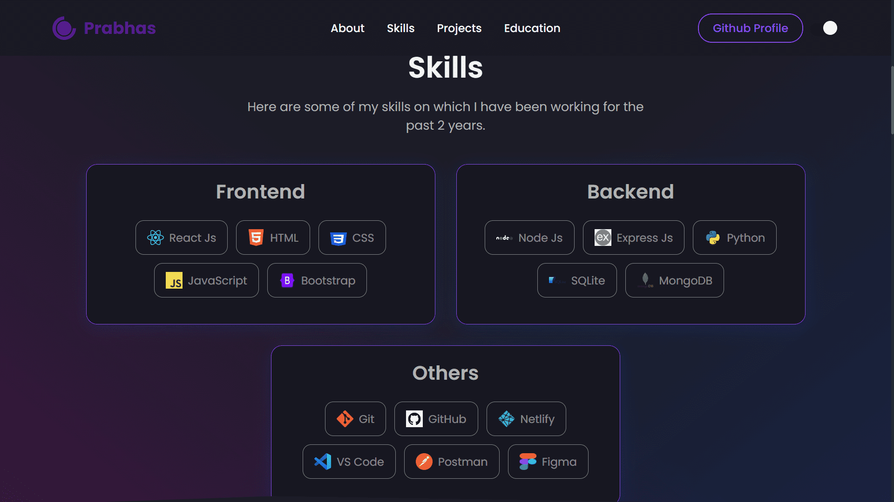
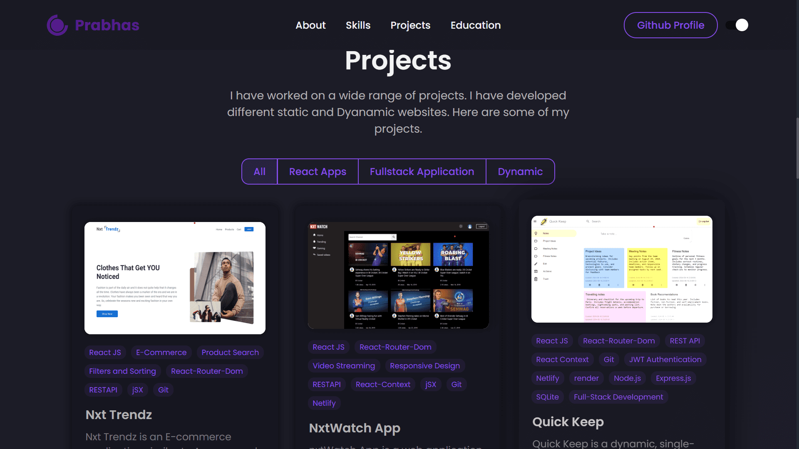
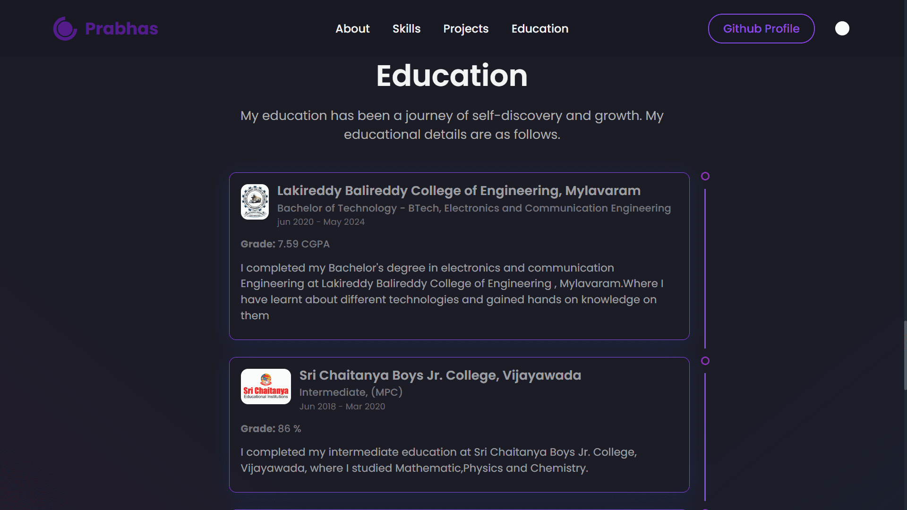
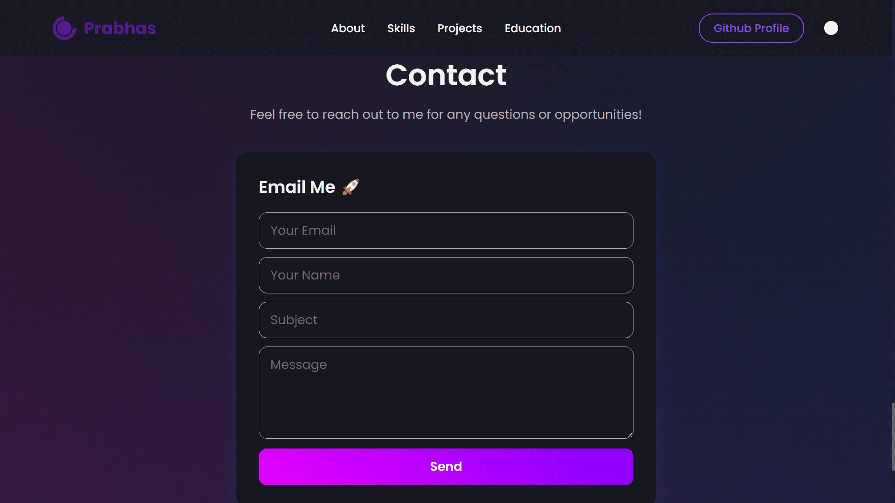
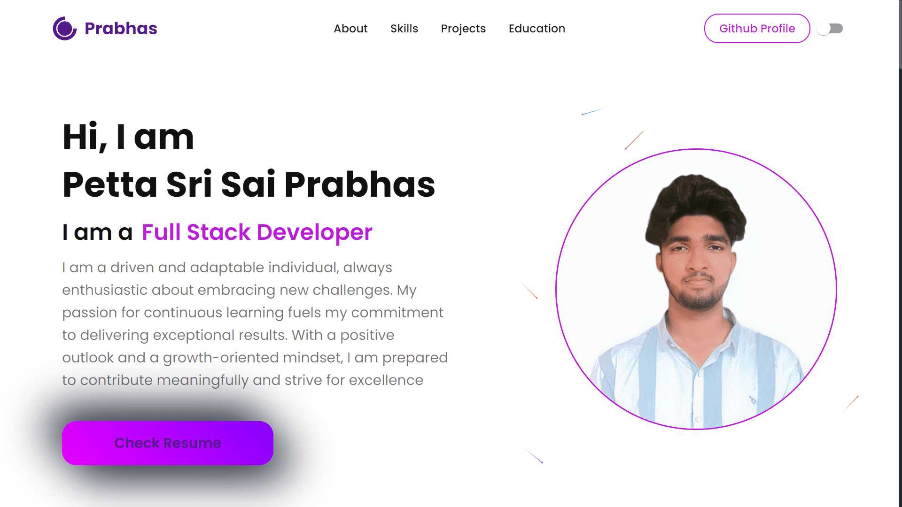
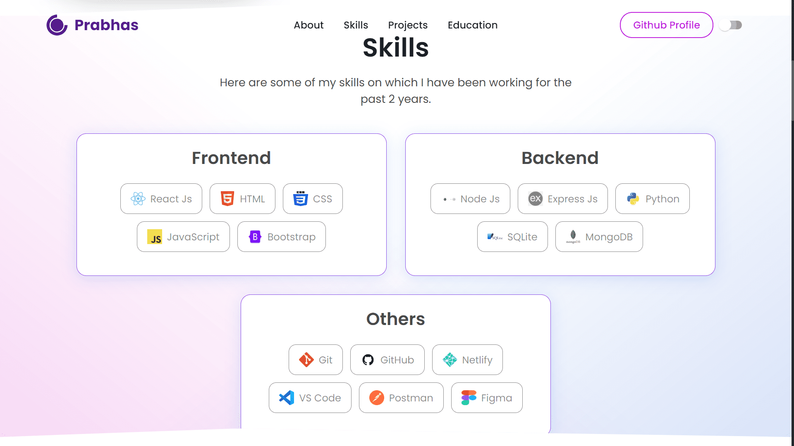
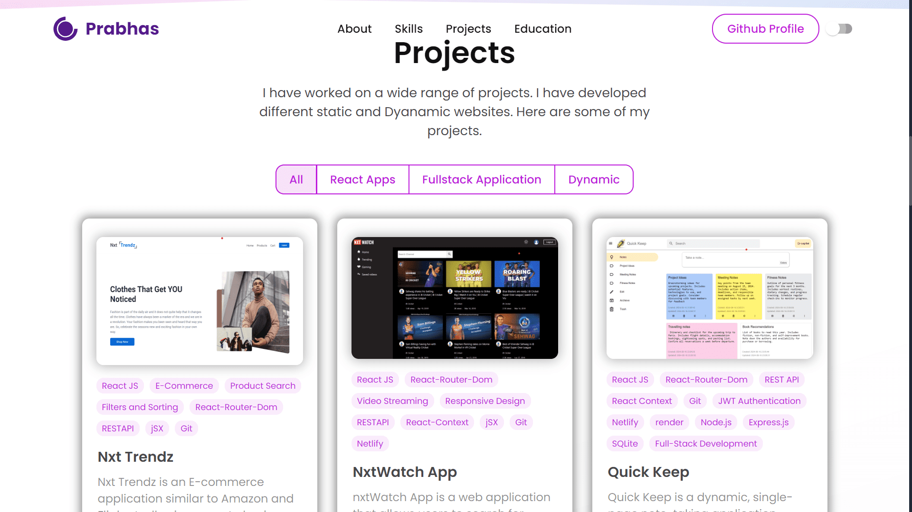
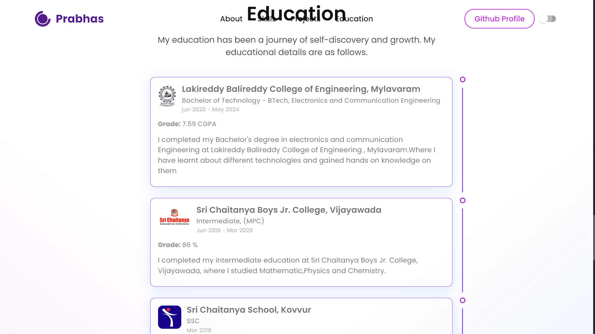
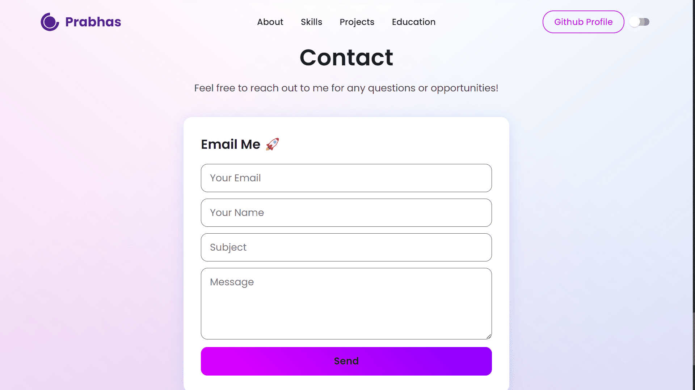

# My Portfolio

Welcome to my portfolio! This project showcases my skills, projects, and experiences as a web developer.

### Weblink: [Live Website](https://prabhas9346.github.io/portfolio/)

## Images

<table>
  <tr>
    <td>
      
      
      
      
      
    </td>
    <td>
      
      
      
      
      
    </td>
  </tr>
</table>

## Table of Contents

-   [Introduction](#introduction)
-   [Features](#features)
-   [Technologies Used](#technologies-used)
-   [Usage](#usage)
-   [Contact](#contact)

## Introduction

This portfolio is a React.js application designed to present my work, skills, and achievements as a web developer. It offers an overview of my background, showcases my projects, and provides a way for visitors to contact me.

## Features

-   **About Me:** Provides a brief overview of my background, skills, and experiences.
-   **Projects:** Highlights notable projects with detailed descriptions, screenshots, and links.
-   **Skills:** Lists my technical skills and proficiencies.
-   **Resume:** A link to download my resume.
-   **Contact:** A form to send me messages or inquiries.

## Technologies Used

-   **React.js:** A JavaScript library for building user interfaces.
-   **HTML5 & CSS3:** Markup and styling languages for creating web pages.
-   **JavaScript:** Programming language for adding interactivity to web applications.
-   **Styled-Components:** A CSS-in-JS library for styling React components.
-   **Git:** Version control system for tracking changes and collaboration.
-   **GitHub Pages & Netlify:** Platforms for hosting and deploying web applications.
-   **React Hooks:** Hooks for managing state and side effects in functional components.

## Usage

Once the project is set up and running locally, you can explore the portfolio using the navigation menu. The "About Me" section offers insights into my background and skills, while the "Projects" section provides detailed information about my work, including descriptions and screenshots. The "Contact" section allows visitors to reach out with any inquiries or messages.

## Contact

For more information or inquiries, feel free to reach out to me via the following platforms:

-   **GitHub:** [Prabhas9346](https://github.com/Prabhas9346)
-   **LinkedIn:** [Sri Sai Prabhas Petta](https://www.linkedin.com/in/sri-sai-prabhas-petta-437542228/)
-   **Resume:** [Download Resume](https://drive.google.com/file/d/1MozpAW_G_kwg_sTG7d6eB-ujApb7xaPg/view?usp=sharing)
